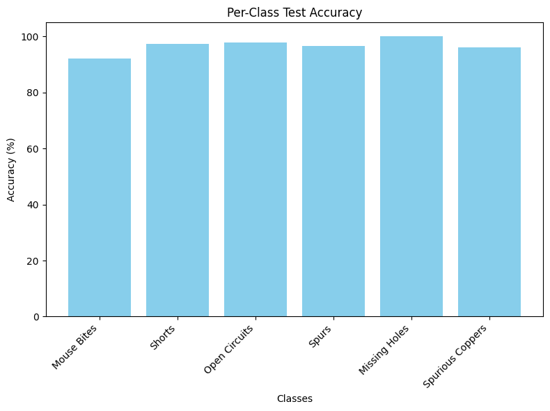

# PCB-Defect-Classification

This is the repository for 11785 Project, featuring PCB Defect Classification.

Configurations of the models we tested are available in [exp](./exp/). You can check the config.yaml for details of the model architecture.

# How to run

## Install dependencies

Before running our codes, please install required dependencies,

```
pip install -r requirements.txt
```

## Get dataset

We use dataset from [VOC_PCB](https://github.com/Ixiaohuihuihui/Tiny-Defect-Detection-for-PCB). Thanks so much for their awesome work!

R. Ding, L. Dai, G. Li and H. Liu, "TDD-net: a tiny defect detection network for printed circuit boards," in CAAI Transactions on Intelligence Technology, vol. 4, no. 2, pp. 110-116, 6 2019, doi: 10.1049/trit.2019.0019.

To download the dataset, please run `data/download.sh`. It will automatically download and decompress the data for you.

Samples from the dataset:


## Code

All notebooks are in [code](./code/), please `cd code` and run the one that you want to test.

Since our code is deeply coupled with `wandb`, so please create an account there are put your key inside the notebook. Otherwise you cannot successfully run it.

# Result

```
Overall Test Loss: 0.1538
Overall Test Accuracy: 96.58%

Per-Class Results:
Mouse Bites - Accuracy: 92.04%, Loss: 0.3406
Shorts - Accuracy: 97.41%, Loss: 0.0926
Open Circuits - Accuracy: 97.88%, Loss: 0.1002
Spurs - Accuracy: 96.61%, Loss: 0.2200
Missing Holes - Accuracy: 100.00%, Loss: 0.0020
Spurious Coppers - Accuracy: 96.11%, Loss: 0.1423
```



For more information, please go to [reports](./reports) to see our project reports.

[Midterm report](./reports/Midterm.pdf)

[Final report](./reports/Final.pdf)
